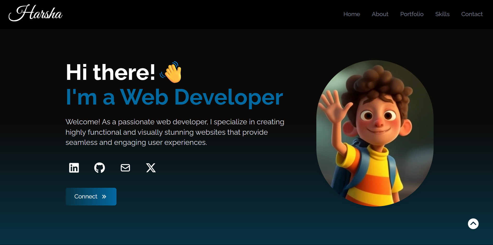

# P VM Harsha's Portfolio

A personal portfolio website to showcase your skills, projects, and contact information.



[](LICENSE)
[](https://react.dev/)
[](https://tailwindcss.com/)
[](https://developer.mozilla.org/en-US/docs/Web/HTML)
[](https://developer.mozilla.org/en-US/docs/Web/CSS)
[](https://developer.mozilla.org/en-US/docs/Web/JavaScript)
[](https://git-scm.com/)
[](https://github.com/)
[](https://pages.github.com/)

---

## ✨ Features

- Modern, responsive design
- Project showcase section
- Skills and education highlights
- Contact form or contact information
- Easy navigation

## 🚀 Tech Stack

- **React** – Frontend library
- **Tailwind CSS** – Styling framework
- **JavaScript** – Core language
- **HTML5 & CSS3** – Markup and styling
- **Git & GitHub** – Version control and hosting

## 🛠️ Getting Started

1. **Clone the repository:**
   ```bash
   git clone https://github.com/pvm-harshavardhan/pvmportfolio.git
   cd portfolio
   ```

2. **Install dependencies:**
   ```bash
   npm install
   ```

3. **Start the development server:**
   ```bash
   npm start
   ```

4. **Open in browser:**  
   Visit `http://localhost:3000`

## 🖼️ Customization

- Update your information in the relevant components (name, skills, projects, etc.).
- Replace `assets/screenshot.png` with your own screenshot.
- Update favicon and meta tags for better SEO.

## 🌐 Deployment

Deploy your portfolio easily using platforms like **Vercel**, **Netlify**, or **GitHub Pages**.

## 📄 License

This project is licensed under the [CC0 1.0 Universal (Public Domain Dedication)](LICENSE).

---
